class: middle, center, title-slide

 

# Scaling-up simulation-based inference with diffusion models

 

London Meeting on Computational Statistics 
April 29, 2026

.grid[
.kol-1-3[
.width-60.circle[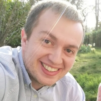]
]
.kol-2-3[

 
Gilles Louppe 
[g.louppe@uliege.be](mailto:g.louppe@uliege.be) 
[http://glouppe.github.io](https://glouppe.github.io)

]
]

???

Good morning everyone, and thank you for the invitation to speak today, it is a pleasure to be here.

My goal today is to give you a brief overview of some of the work we have been doing at the intersection of deep learning and inverse problems in science. We will look at three different scales of inverse problems, from low-dimensional to extra-large, and see how deep generative models can help us tackle them.

---

class: middle, black-slide, center
background-image: url(figures/y.png)
background-size: cover

.bold.larger[From a noisy observation $y$...]

???

As a starting example, imagine we have a noisy observation $y$ of some underlying physical process.

The observation could be a low-resolution satellite image of the atmosphere, a noisy medical scan, or simply a photograph taken in low light conditions.

---

class: middle, black-slide, center
background-image: url(figures/x.png)
background-size: cover

.bold.larger[... can we recover   all plausible states $x$?]

???

Our goal today is then quite simple: given the noisy observation $y$, can we recover all plausible physical states $x$ that could have caused this observation?

For instance, if $y$ is a sparse and resolution-limited satellite image of the atmosphere, can we recover a high-resolution estimate of the full 3d volume that is consistent with this observation?

---

class: middle

.center.width-80[]

## Inverse problems in science

Given noisy observations $y$, estimate either
- the posterior distribution $p(x|y) \propto p(x) p(y|x)$ of latent states $x$, or
- the posterior distribution $p(\theta|y)$ of model parameters $\theta$.

???

Inverse problems are common in science, because experimental measurements are neither direct nor perfect. Instead, we have to deal with instrumental noise, limited resolution, incomplete or indirect observations. As a result, our only resort is to guess the underlying physical state or model parameters that could have led to these observations, and to quantify the uncertainty in our estimates.

Formally, we want to estimate either the posterior distribution $p(x|y)$ of latent states $x$ given noisy observations $y$, or the posterior distribution $p(\theta|y)$ of model parameters $\theta$.

Why is this hard?
- Models and simulators are expressed in terms of forward processes, which often implement causal mechanistic assumptions about the physical process or the data acquisition process. In this form, they can be used to generate synthetic data, but they cannot be inverted easily.
- The problem is fundamentally ill-posed. There is not a single solution but a whole distribution of plausible solutions.

---

class: middle

.center.width-10[]

.alert[In this talk, $\theta$ is $O(10)$-dimensional, while $x$ and $y$ are $O(10^3)$ to $O(10^{10})$-dimensional. At that scale, classical SBI methods break down.]

---

class: middle

## Diffusion models 101

Samples $x \sim p(x)$ are progressively perturbed through a diffusion process described by the forward SDE $$\text{d} x\_t = f\_t x\_t \text{d}t + g\_t \text{d}w\_t,$$
where $x\_t$ is the perturbed sample at time $t$.

.center[
.width-90[]
Forward diffusion process.
]

.footnote[Credits: [Song](https://yang-song.net/blog/2021/score/), 2021.]

???

Diffusion models are a class of deep generative models that learn to generate data by reversing a gradual noising process.

The forward process progressively adds noise to the data, until it becomes pure noise. Mathematically, this process can be described by a stochastic differential equation (SDE) corresponding to a diffusion process.

---

class: middle

The reverse process satisfies a reverse-time SDE that can be derived analytically from the forward SDE as $$\text{d}x\_t = \left[ f\_t x\_t - g\_t^2 \nabla\_{x\_t} \log p(x\_t) \right] \text{d}t + g\_t \text{d}w\_t.$$

Therefore, to generate data samples $x\_0 \sim p(x\_0) \approx p(x)$, we can draw noise samples $x\_1 \sim p(x\_1) \approx \mathcal{N}(0, \Sigma\_1)$ and gradually remove the noise therein by simulating the reverse SDE from $t=1$ to $0$.

.center[
.width-90[]
Reverse denoising process.
]

.footnote[Credits: [Song](https://yang-song.net/blog/2021/score/), 2021.]

???

The time-reversed process can also be described by an SDE, which involves the score function $\nabla\_{x\_t} \log p(x\_t)$ of the perturbed data distribution at time $t$.

Therefore, to generate samples from the data distribution, we can start from pure noise and gradually denoise it by simulating the reverse SDE.

---

class: middle 

.center.width-90[]

The .bold[score function] $\nabla\_{x\_t} \log p(x\_t)$ is unknown, but can be approximated by a neural network $d\_\theta(x\_t, t)$ by minimizing the denoising score matching objective
$$\mathbb{E}\_{p(t)p(x)p(x\_t|x)} \left[ || d\_\theta(x\_t, t) - x ||^2\_2 \right].$$
The optimal denoiser $d\_\theta$ is the mean $\mathbb{E}[x | x\_t]$ which, via Tweedie's formula, leads to the approximation
$$\nabla\_{x\_t} \log p(x\_t) = \Sigma\_t^{-1}(\mathbb{E}[x | x\_t] - x\_t) \approx \Sigma\_t^{-1}(d\_\theta(x\_t, t) - x\_t) = s\_\theta(x\_t, t).$$

???

To make this work in practice however, we need to know the score function $\nabla\_{x\_t} \log p(x\_t)$, which is not the case.

Instead, we can train a neural network $d\_\theta(x\_t, t)$ to approximate the score function by minimizing a denoising score matching objective.

In short, we train the neural network to denoise perturbed samples $x\_t$ at different noise levels $t$ by predicting the original clean sample $x$. 

The optimal denoiser is the conditional mean $\mathbb{E}[x | x\_t]$, which can be used to compute a score estimate via Tweedie's formula.

---

class: middle

## Inverting single observations

To turn a diffusion model $p\_\theta(\mathbf{x})$ into a conditional model $p\_\theta(\mathbf{x} | y)$, we can .red.bold[hard-wire] conditioning information $y$ as an additional input to the denoiser $d\_\theta(x\_t, t, y)$ and train the model on pairs $(x, y)$.

???

Now that we have a basic understanding of diffusion models, let's see how we can use them to solve inverse problems.

The most straightforward approach is to hard-wire the conditioning information $y$ as an additional input to the denoiser.

This works well when we have access to many pairs $(x, y)$ to train the model on, but it is not always practical or possible.

---

class: middle

.center.width-10[]

An alternative strategy is to replace, at sampling time, the score function $\nabla\_{x\_t} \log p(x\_t)$ in the reverse SDE by the posterior score $\nabla\_{x\_t} \log p(x\_t|y)$.

This is convenient because the posterior score $\nabla\_{x\_t} \log p(x\_t|y)$ decomposes as
$$\begin{aligned}
\nabla\_{x\_t} \log p(x\_t|y) &= \nabla\_{x\_t} \log p(x\_t) + \nabla\_{x\_t} \log p(y|x\_t) - \sout{\nabla\_{x\_t} \log p(y)} \\\\
&\approx s\_\theta(x\_t, t) + \nabla\_{x\_t} \log p(y|x\_t),
\end{aligned}$$
which enables .bold[zero-shot posterior sampling] from a diffusion prior $p(x\_0)$ without having to hard-wire the neural denoiser to the observation model $p(y|x)$.

???

An alternative approach is to notice that the posterior score $\nabla\_{x\_t} \log p(x\_t|y)$ can be decomposed using Bayes' rule into the sum of the prior score $\nabla\_{x\_t} \log p(x\_t)$ and the likelihood score $\nabla\_{x\_t} \log p(y|x\_t)$.

- If we have a diffusion model of the prior $p(x\_0)$, then we have access to the prior score via Tweedie's formula.
- If we have a model of the observation process $p(y|x)$, we can use it to estimate the likelihood score.

In short, this trick enables zero-shot posterior sampling from a diffusion prior without having to hard-wire the neural denoiser to the observation model.

---

class: middle

.avatars[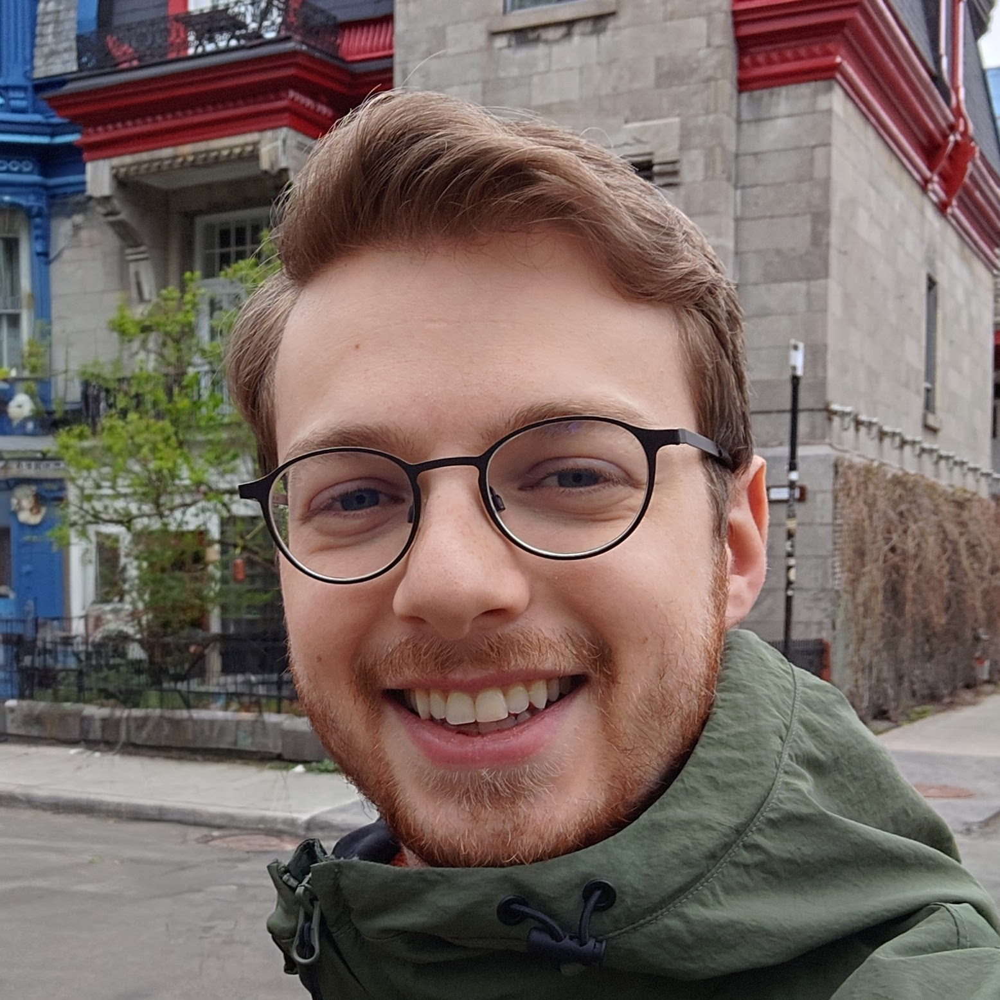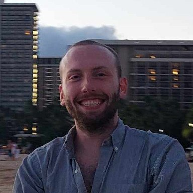]

## Approximating $\nabla\_{x\_t} \log p(y | x\_t)$ with MMPS

We want to estimate the score $\nabla\_{x\_t} \log p(y | x\_t)$ of the noise-perturbed likelihood $$p(y | x\_t) = \int p(y | x) p(x | x\_t) \text{d}x.$$

Our approach (MMPS, Rozet et al, 2024):
- Assume a linear Gaussian observation model $p(y | x) = \mathcal{N}(y | Ax, \Sigma\_y)$.
- Assume the approximation $p(x | x\_t) \approx \mathcal{N}(x | \mathbb{E}[x | x\_t], \mathbb{V}[x | x\_t])$,  where $\mathbb{E}[x | x\_t]$ is estimated by the denoiser and $\mathbb{V}[x | x\_t]$ is estimated using Tweedie's covariance formula.
- Then $p(y | x\_t) \approx \mathcal{N}(y | A \mathbb{E}[x | x\_t], \Sigma\_y + A \mathbb{V}[x | x\_t] A^T)$.
- The score $\nabla\_{x\_t} \log p(y | x\_t)$ then approximates to 
$$\nabla\_{x\_t} \mathbb{E}[x | x\_t]^T A^T (\Sigma\_y + A \mathbb{V}[x | x\_t] A^T)^{-1} (y - A \mathbb{E}[x | x\_t]).$$

.footnote[Credits: [Rozet et al](https://arxiv.org/abs/2405.13712), 2024 (arXiv:2405.13712).]

---

class: middle

.avatars[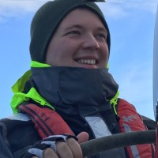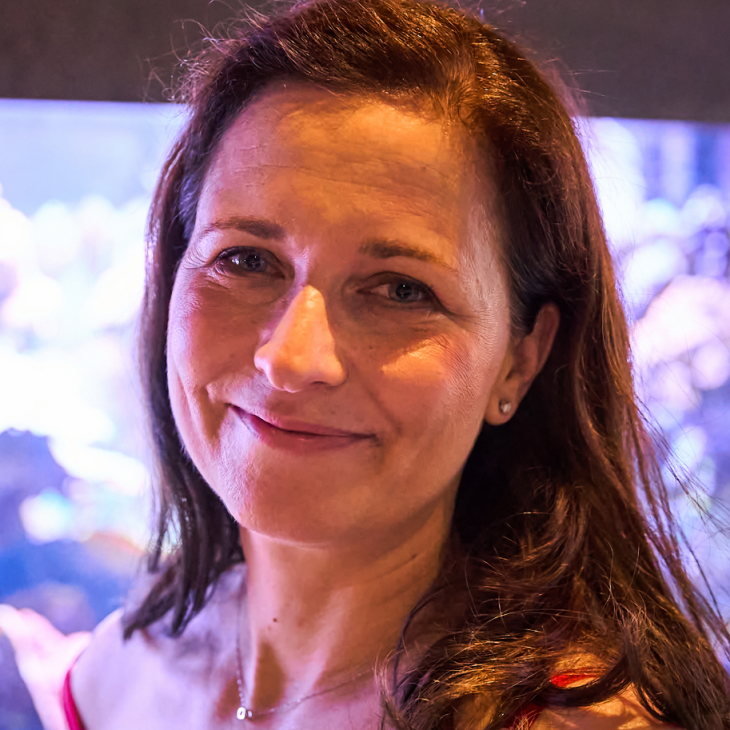]

## Example 1: Nowcasting sea hypoxia from satellite observations

Posterior oxygen maps $p(x|y)$ are recovered from surface satellite observations $y$ via zero-shot posterior sampling under a diffusion prior $p(x)$ of Black Sea dynamics.

.center.width-100[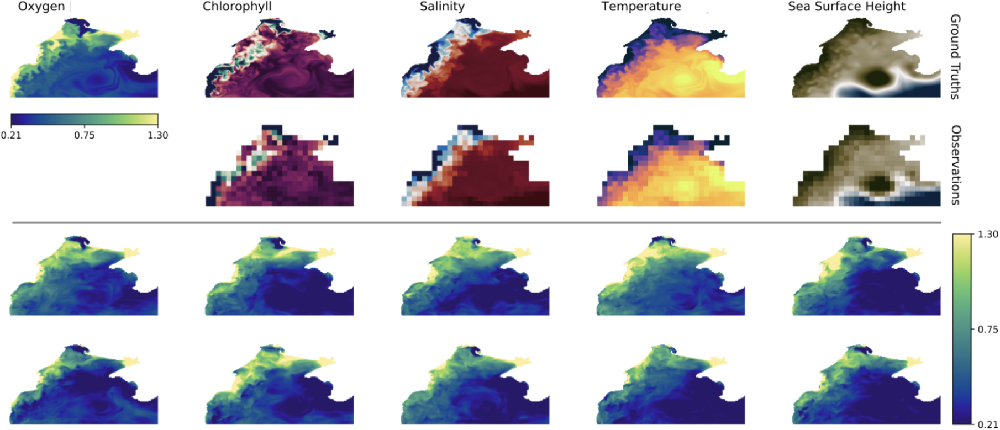]

.footnote[Credits: [Mangeleer et al](https://arxiv.org/abs/2604.25608), 2026 (arXiv:2604.25608).]

???

Fortunately, good enough physical models of the Black Sea exist, which can be used to produce reanalysis data and  train a diffusion prior $p(x)$ of realistic 3d oceanic states $x$, including temperature, salinity, and oxygen concentration.

Our preliminary results show that we can recover realistic 3d oxygen maps from satellite observations of the surface. 

More work is needed to validate these results and to improve the model, but we are optimistic that this approach can provide valuable insights into the dynamics of hypoxia in the Black Sea.

---

class: middle

.avatars[]

.center.width-100[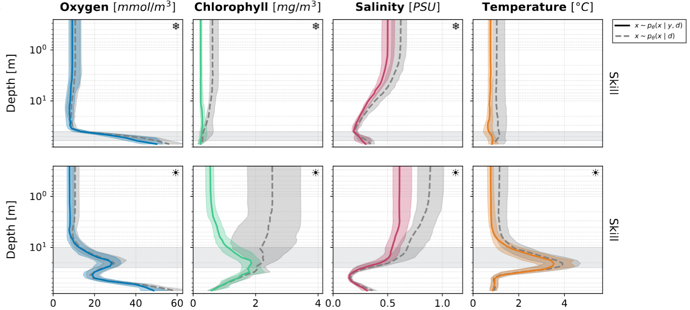]

.center[State reconstruction $x$ from satellite observations $y$ of the surface.  In the mixing layer, states can be reconstructed, but not in the hypoxic layer.]

.footnote[Credits: [Mangeleer et al](https://arxiv.org/abs/2604.25608), 2026 (arXiv:2604.25608).]

---

class: middle

## Example 2: Dynamical reconstruction of past atmospheric states

The goal of .bold[data assimilation] is to estimate plausible trajectories $x\_{1:L}$ given noisy observations $y\_{1:L}$ as the posterior $$p(x\_{1:L} | y\_{1:L}) \propto p(x\_1) p(y\_1 | x\_1) \prod\_{i=2}^{L} p(x\_{i} | x\_{i-1}) p(y\_{i} | x\_{i}).$$

.center.width-100[]

???

Formally, the instance of this inverse problem is known as data assimilation in the geosciences.

Assume the latent state $x$ evolves according to a transition model $p(x\_{i+1} | x\_i)$ and is observed through an observation model $p(y | x\_{1:L})$. (Typically, the observation model will be $p(y\_i | x\_i)$, but we consider the general case here.) 

The goal of data assimilation is to estimate plausible trajectories $x\_{1:L}$ given one or more noisy observations $y$ (or $y\_{1:L})$ as the posterior distribution $p(x\_{1:L} | y)$.

This is an important problem as it
- helps understand past atmospheric states, which is critical for climate science.
- but also bootstraps weather forecasting, as the quality of weather forecasts depends on the quality of the initial conditions provided by data assimilation.

---

class: middle

.avatars[]

.center.width-100[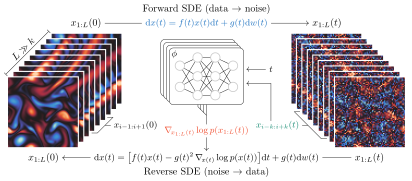]

Score-based data assimilation (Rozet and Louppe, 2023):
- Build a score-based generative model $p(x\_{1:L})$ of arbitrary-length trajectories. 
- Use zero-shot posterior sampling to generate plausible trajectories from noisy observations $y$.

.footnote[Credits: [Rozet and Louppe](https://arxiv.org/abs/2306.10574), 2023 (arXiv:2306.10574).]

???

The strategy we proposed to tackle this problem is called score-based data assimilation and follows the same principles as before:
- First, we build a score-based generative model $p(x\_{1:L})$ of arbitrary-length trajectories. This model captures the complex spatiotemporal dependencies in the data and can generate realistic trajectories.
- Then, we use zero-shot posterior sampling to generate plausible trajectories from noisy observations $y$. This allows us to recover the posterior distribution $p(x\_{1:L} | y)$ of trajectories given the observations.

---

class: middle

.avatars[]

.center.width-100[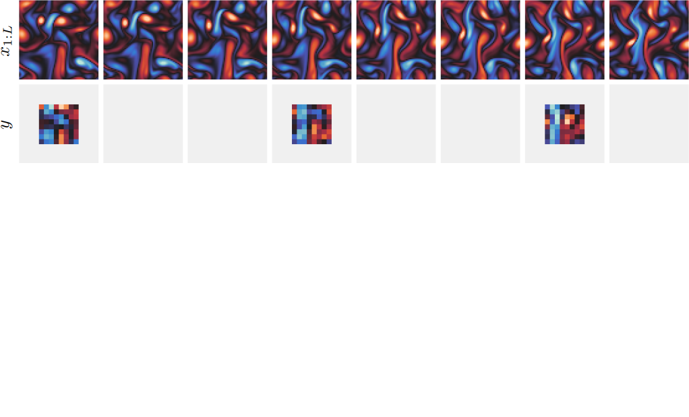]

.center[Sampling $x\_{1:L}$ from noisy, incomplete and coarse-grained observations $y$.]

.footnote[Credits: [Rozet and Louppe](https://arxiv.org/abs/2306.10574), 2023 (arXiv:2306.10574).]

???

To illustrate this, here is an example of a data assimilation toy problem, where we want to reconstruct trajectories of a 2D turbulent fluid flow from noisy, incomplete and coarse-grained observations.

- The top row shows some ground truth trajectory of  the fluid. 
- The 2nd row shows noisy, incomplete and coarse-grained observations of this trajectory.

Given these few observations, our goal is to estimate the posterior distribution of plausible trajectories that are consistent with these observations.

---

class: middle
count: false

.avatars[]

.center.width-100[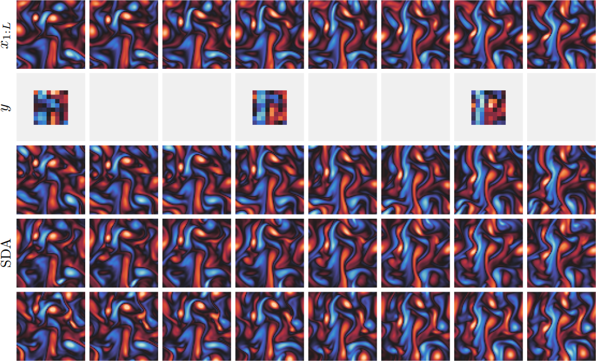]

.center[Sampling $x\_{1:L}$ from noisy, incomplete and coarse-grained observations $y$.]

.footnote[Credits: [Rozet and Louppe](https://arxiv.org/abs/2306.10574), 2023 (arXiv:2306.10574).]

???

As you can see, SDA successfully recovers realistic trajectories that are consistent with the observations, while also capturing the uncertainty in the reconstruction.

---

class: middle, black-slide

.center.width-40[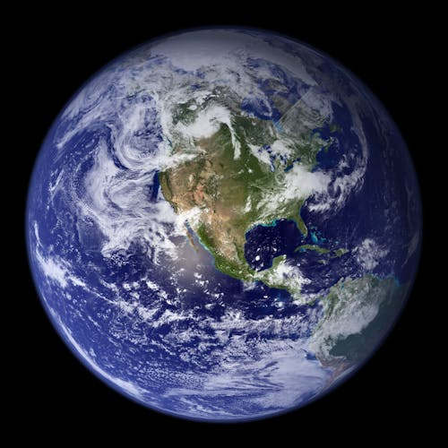]

At 0.25° resolution, for 6 atmospheric variables, 13 pressure levels, hourly time steps, and 14 days of simulation, a trajectory $x\_{1:L}$ contains $721 \times 1440 \times 6 \times 13 \times 24 \times 14 = 27 \times 10^9$ variables.

.grid[
.kol-1-5[.center.width-50[]]
.kol-4-5[.center.bold[$O(10^9)$ variables (or more) is needed  to capture the complexity of the atmosphere.]]
]

???

This is all well and good, but can this approach scale to a whole Earth model?

If we want to capture the complexity of the atmosphere, we need to work at high resolution and account for many variables. For instance, at 0.25° resolution, for 6 atmospheric variables, 13 pressure levels, hourly time steps, and 14 days of simulation, a trajectory $x\_{1:L}$ contains $27 \times 10^9$ variables.

This is orders of magnitude larger than what current diffusion models can handle directly in the data space.

---

class: middle

.avatars[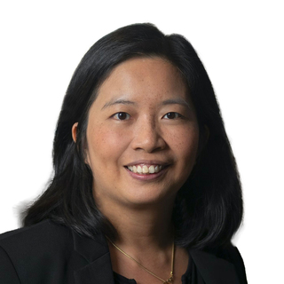]

## Latent diffusion models for physics emulation

.center.width-100[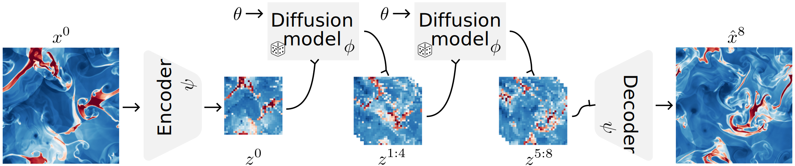]

.grid[
.kol-3-4[
.center[
<video poster="" id="video" controls="" muted="" loop="" width="100%" autoplay>
        <source src="https://polymathic-ai.org/images/blog/latent_space_vid/euler_f32c64.mp4" type="video/mp4">
</video>
]
]
.kol-1-4[  LDMs trained on compressed latent states $z = E(x)$ remain accurate even at high compression rates.]
]

.footnote[Credits: [Rozet et al](https://arxiv.org/abs/2507.02608), 2025 (arXiv:2507.02608).]

???

As often in deep learning, a solution to this problem is to go deeper, to add a new layer of abstraction.

Latent diffusion models can help us here by learning a diffusion prior in a compressed latent space $z$ of much lower dimension than the data space $x$. Assuming the data can be compressed well, this allows us to work with a much smaller number of variables, and then decode the latent samples back to the data space.

---

class: middle

.avatars[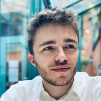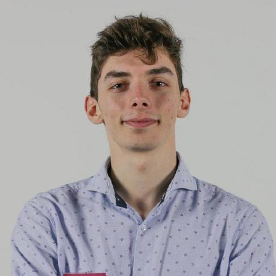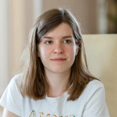]

.center.width-80[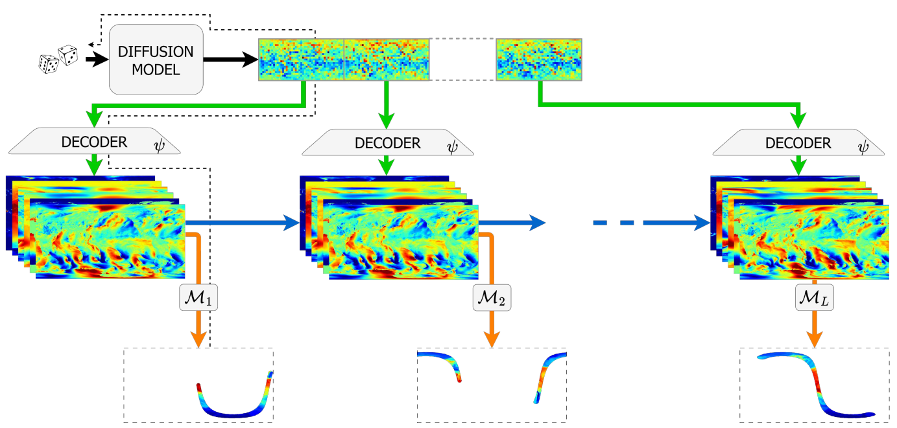]

## Example 3: Appa, an LDM of atmospheric dynamics

- a 500M-parameter autoencoder $(E, D)$ that compresses data $x$ into latent representations $z=E(x)$ with a 450x compression factor;
- a 1B-parameter .bold[latent diffusion model] that generates latent trajectories $z\_{1:L}$ decoded back to data space as $x\_{1:L} = D(z\_1), ..., D(z\_L)$.

.footnote[Credits: [Andry et al](https://arxiv.org/abs/2504.18720), 2025 (arXiv:2504.18720).]

???

Based on this idea, we have recently developed Appa, an extension of SDA built on a latent diffusion model of atmospheric dynamics.

Appa is made of three components:
- a 500M-parameter autoencoder that compresses data $x$ into latent representations $z=E(x)$ with a 450x compression factor;
- a 1B-parameter diffusion model that generates latent trajectories $z\_{1:L}$;
- a posterior sampling algorithm.

This combination allows us to perform data assimilation at the scale of the whole Earth, while still capturing the complexity of the atmosphere.

---

class: middle

The decoder $D(z)$ and the observation model $p(y|x) = \mathcal{N}(y; \mathcal{M}(x), \Sigma\_y)$ form a .bold[non-linear observation model] in the latent space $$p(y|z) = \mathcal{N}(y; \mathcal{A}(z), \Sigma\_y),$$
where $\mathcal{A}(z) = \mathcal{M}(D(z))$ is the composition of the decoder and the observation operator.

Sampling from the posterior requires the noise-perturbed likelihood $p(y|z\_t)$, which we approximate by linearization as
$$p(y|z\_t) \approx \mathcal{N}(y; \mathcal{A}(\mathbb{E}[z|z\_t]), \Sigma\_y + A \mathbb{V}[z|z\_t] A^T),$$
where $A$ is the Jacobian of $\mathcal{A}$ at $\mathbb{E}[z|z\_t]$.

.footnote[Credits: [Andry et al](https://arxiv.org/abs/2504.18720), 2025 (arXiv:2504.18720).]

---

class: middle

.center[
<video poster="" id="video" controls="" muted="" loop="" width="82%" autoplay>
<source src="https://montefiore-sail.github.io/appa/static/videos/reanalysis/reanalysis_1week.mp4" type="video/mp4">
</video>
]

.footnote[Credits: [Andry et al](https://arxiv.org/abs/2504.18720), 2025 (arXiv:2504.18720).]

???

In this slide, you can see a reanalysis of past data using Appa for a subset of physical variables.
- Rows 1 and 4 show the ground truth from ERA5 reanalysis.
- Rows 2 and 5 show the noisy, incomplete and coarse-grained satellite observations as well as in-situ measurements from weather stations.
- Rows 3 and 6 show samples from the posterior distribution $p(x\_{1:L} | y\_{1:L})$ produced by Appa. 

---

class: middle

.center.width-10[]

## Conclusions

.success[High-dimensional Bayesian inference in complex physical models becomes possible with diffusion models and zero-shot posterior sampling.]

.alert[However, many challenges remain to be tackled to make these methods more robust, accurate and scalable.]

---

count: false

 
.center.width-10[] 

.center[

.width-15.circle[] 
.width-15.circle[] 
.width-15.circle[] 
.width-15.circle[]

.width-15.circle[] 
.width-15.circle[] 
.width-15.circle[] 
.width-15.circle[]

(Gérome, François, Victor, Omer, Sacha, Matthias, Elise, Thomas)

]

---

class: middle, center, end-slide
count: false

The end.

